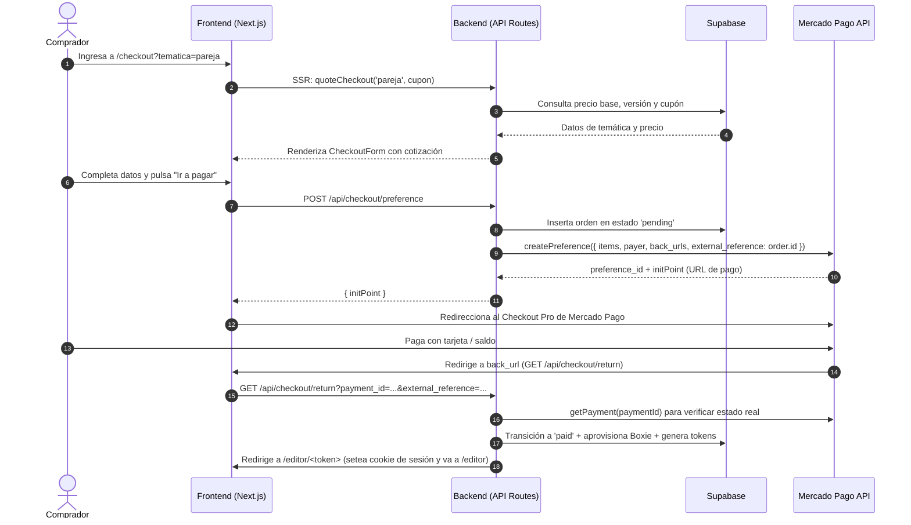

# Flujo de Checkout, Pasarela de Pago y Guía de Testing

Este documento describe el flujo completo de compra, integración con la pasarela de pago (Mercado Pago), aprovisionamiento de la Boxie y los pasos detallados para testear cada escenario en local.

---

## 1. Arquitectura y Flujo Completo



> [!NOTE]
> Todavía no hay webhook de Mercado Pago: el pago se confirma solo cuando el comprador vuelve al
> sitio (`/api/checkout/return`). Si cierra la pestaña antes de volver, la orden queda `pending`
> aunque haya pagado. `MP_WEBHOOK_SECRET` se va a usar cuando exista el webhook.

---

## 2. Requisitos Previos: El parámetro `tematica`

La ruta del checkout es:

```
http://localhost:3000/checkout?tematica=<slug>
```

> [!IMPORTANT]
> El valor de `tematica` debe coincidir exactamente con el **slug** de una temática existente y en estado `published` en la base de datos (o en el catálogo semilla). Si no se envía o el slug no existe, el servidor redirige a `/galeria`.

Temáticas disponibles por defecto:

- **`pareja`**
- **`cumpleanos`**
- **`amistad`**

Cupones de prueba iniciales:

- `BOXIE10` (10% de descuento)
- `PAREJA20` (20% de descuento)

---

## 3. Escenarios de Prueba

### Método A: Probar con Mercado Pago (Flujo Real)

Este método prueba toda la integración real: formulario, generación de preferencia, ventana de pago de Mercado Pago y retorno a la aplicación.

#### 1. Configuración de `.env.local`

Asegurate de tener configuradas las siguientes variables:

```env
NEXT_PUBLIC_SITE_URL=http://localhost:3000
PAYMENTS_PROVIDER=mercadopago
MP_ACCESS_TOKEN=APP_USR-XXXXXXXXXXXXXXXX-XXXXXX-XXXXXXXXXXXXXXXXXXXXXXXXXXXXXXXX-XXXXXXXXXX
# MP_WEBHOOK_SECRET= (opcional para el retorno básico en local)
DEMO_MODE=
```

> [!WARNING]
> Las credenciales de prueba de Mercado Pago ahora también empiezan con `APP_USR-`. Para probar,
> usá el Access Token de un **usuario de prueba vendedor** (Tus integraciones → Cuentas de
> prueba) y pagá logueado con **otro usuario de prueba comprador**: así no se cobra nada real.
> Nunca uses las credenciales de tu cuenta real para probar.
>
> El pago se hace en el checkout normal de Mercado Pago (`init_point`). El checkout sandbox
> (`sandbox_init_point`) es el flujo viejo de los tokens `TEST-`: con las credenciales nuevas
> falla con "Oh, no, algo anduvo mal". Solo se usa con `MP_SANDBOX=true`.

#### 2. Pasos para ejecutar la prueba

1. Iniciá el servidor de desarrollo:
   ```bash
   npm run dev
   ```
2. Abrí en el navegador:
   ```
   http://localhost:3000/checkout?tematica=pareja
   ```
3. Podés probar aplicar un cupón como `PAREJA20` y verificar que el monto baje en tiempo real.
4. Llená los campos del comprador:
   - **Nombre:** Usuario de Prueba
   - **Email:** `test_user_...@testuser.com` _(debe ser distinto al email de la cuenta de MP dueña de las credenciales)_
   - **Teléfono:** 1123456789
   - Aceptá los **Términos y Condiciones**.
5. Hacé clic en **"Ir a pagar"**.
   - El sistema llamará a `/api/checkout/preference`.
   - Se abrirá el Checkout Pro de Mercado Pago: entrá con el usuario de prueba comprador.

#### 3. Tarjetas de prueba de Mercado Pago (Argentina)

| Estado deseado                       | Número de tarjeta     | Vencimiento | Código | Titular | DNI        |
| :----------------------------------- | :-------------------- | :---------- | :----- | :------ | :--------- |
| **Aprobado**                         | `4242 4242 4242 4241` | `11/27`     | `123`  | APRO    | `12345678` |
| **Rechazado (Fondos insuficientes)** | `4242 4242 4242 4244` | `11/27`     | `123`  | FUND    | `12345678` |
| **Rechazado general**                | `4242 4242 4242 4242` | `11/27`     | `123`  | RECH    | `12345678` |
| **Pendiente**                        | `4242 4242 4242 4240` | `11/27`     | `123`  | PEND    | `12345678` |

#### 4. Validación del resultado

- Al aprobarse el pago, Mercado Pago redirige a:
  `http://localhost:3000/api/checkout/return?payment_id=...&external_reference=...`
- El backend valida el pago con la API de MP, crea la Boxie y redirige a `/editor/<token>`.
- La ruta de canje guarda la cookie de sesión firmada `boxie_editor` y te deja en:
  `http://localhost:3000/editor`
- En la consola del servidor verás la notificación del email de compra emitido (o enviado por Resend si tenés configurada `RESEND_API_KEY`).

---

### Método B: Bypass rápido de pasarela (`PAYMENTS_PROVIDER=fake`)

Si querés probar la experiencia de personalización en el editor, subida de fotos y entrega del regalo sin pasar por la pasarela de Mercado Pago:

1. Modificá temporalmente en `.env.local`:
   ```env
   PAYMENTS_PROVIDER=fake
   ```
   Con esto, **"Ir a pagar"** en el checkout aprueba la orden sin pasar por Mercado Pago y te lleva
   directo al editor. En producción `fake` se rechaza.
2. O, sin pasar por el checkout, ejecutá una llamada POST para aprovisionar una Boxie pagada al instante:

   **En PowerShell:**

   ```powershell
   Invoke-RestMethod -Uri "http://localhost:3000/api/dev/boxies" -Method Post -ContentType "application/json" -Body '{"tematica":"pareja","nombre":"Juan Perez","email":"juan@example.com"}'
   ```

   **En Bash / Git Bash:**

   ```bash
   curl -X POST http://localhost:3000/api/dev/boxies \
     -H "content-type: application/json" \
     -d '{"tematica":"pareja","nombre":"Juan Perez","email":"juan@example.com"}'
   ```

3. La respuesta JSON devuelve:
   - `code`: Código alfanumérico de la Boxie.
   - `editorUrl`: Link directo para abrir el editor (`http://localhost:3000/editor/<token>`).
   - `giftUrl`: Link del regalo para el destinatario (`http://localhost:3000/g/<token>`).

---

### Webhooks (pendiente)

Todavía no hay endpoint de webhook (ver la nota del diagrama). Cuando se agregue
`/api/webhooks/mercadopago`, se configura en Mercado Pago Developers → Tus integraciones → Webhooks
y el **Secreto de firma** va en `MP_WEBHOOK_SECRET`. Para probarlo en local hay que exponer el puerto
con `ngrok http 3000` o `cloudflared`.

---

## 4. Archivos Clave del Circuito

- [app/(marketing)/checkout/page.tsx](../app/%28marketing%29/checkout/page.tsx): Página de checkout y validación de temática.
- [app/(marketing)/checkout/CheckoutForm.tsx](../app/%28marketing%29/checkout/CheckoutForm.tsx): Componente interactivo y envío a la API.
- [app/api/checkout/preference/route.ts](../app/api/checkout/preference/route.ts): Creación de orden y preferencia en Mercado Pago (o aprobación directa con `fake`).
- [app/api/checkout/return/route.ts](../app/api/checkout/return/route.ts): Retorno de MP, validación y redirección al editor.
- [src/server/mercadopago.ts](../src/server/mercadopago.ts): Cliente API de Mercado Pago.
- [src/server/payments.ts](../src/server/payments.ts): Lógica de transición de pagos y aprovisionamiento.

---

## 5. Preguntas Frecuentes y Diagnóstico

### ¿Por qué me redirige a `/galeria`?

Ocurre si:

- No pasaste el query param `?tematica=...`.
- El valor de `tematica` no existe en la tabla `themes` con estado `published`.
- El valor contiene caracteres inválidos (solo se admiten letras minúsculas, números y guiones).

### ¿Por qué no aparece el botón "Ir a pagar"?

En su lugar aparece un cartel con links para probar el editor si:

- `DEMO_MODE=1` ("Versión de demostración").
- Las ventas están pausadas desde el panel, en **Configuración** ("Las ventas están pausadas por un
  rato").

Con `PAYMENTS_PROVIDER=fake` el botón sí aparece y aprueba la orden sin pasar por Mercado Pago.

### Error "No se pudo crear la preferencia de pago" al hacer clic en pagar

1. Verificá que `MP_ACCESS_TOKEN` en `.env.local` sea válido y pertenezca al entorno adecuado.
2. Comprobá que la base de datos Supabase esté respondiendo y tenga las tablas requeridas (`orders`, `themes`, `theme_versions`).
